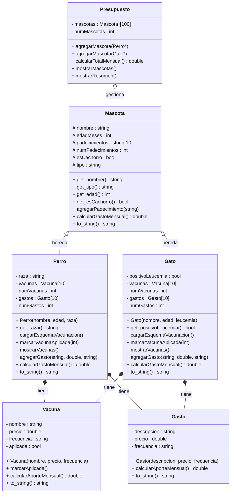

# PetBudget
PetBudget es un sistema orientado a objetos en C++ para ayudar a los dueños de perros y gatos a planear sus gastos veterinarios mensuales. El programa calcula cuánto dinero necesitan apartar cada mes para cubrir los gastos fijos y ahorrar para los gastos anuales de sus mascotas.

---
## Objetivo del proyecto
Desarrollar un planificador financiero para la tenencia responsable de mascotas, que tome en cuenta el protocolo oficial de vacunacion y desparasitación, y permita al usuario registrar gastos adicionales personalizados por mascotas. 

---
## Descripción general del sistema
El programa maneja el flujo completo del cálculo de gastos:
- Registro de perros y gatos con sus datos personales y padecimientos.
- Carga automática del protocolo de vacunación y desparasitación según la especie, edad (cachorro/adulto) y, en el caso de los gatos, resultado del test de leucemia felina.
- Registro manual de medicamentos y gastos adicionales específicos de cada mascota.
- Cálculo del presupuesto mensual total, separando gastos fijos mensuales y ahorro mensual para gastos anuales.

---
## Estructura de clases

| Clase | Descripción |
|-------|-------------|
| `Mascota` | Clase base: nombre, edad, padecimientos |
| `Perro` | Hereda de Mascota; aplica esquema de vacunación canino según edad |
| `Gato` | Hereda de Mascota; considera resultado de test de leucemia felina |
| `Vacuna` | Nombre, precio, frecuencia; precargadas por especie |
| `Gasto` | Medicamentos y gastos adicionales registrados manualmente |
| `Presupuesto` | Gestiona todas las mascotas y calcula el total mensual |

---
## Diagrama UML

---

## Casos que harían fallar el proyecto

- Agregar más de 10 vacunas o gastos a una mascota (límite del arreglo estático).
- Ingresar una edad negativa (el programa calcularía `esCachorro` incorrectamente).
- Marcar un índice de vacuna fuera de rango.
- Registrar más de 100 mascotas (límite del arreglo en `Presupuesto`).

---

## Protocolo de vacunación precargado

Los esquemas están basados en recomendaciones de la WSAVA y precios de referencia de clínicas veterinarias en México (2025).

### 🐶 Perros

**Esquema cachorro (menores de 1 año):**

| Vacuna | Precio referencia (MXN) | Frecuencia |
|--------|------------------------|------------|
| Puppy DP (Moquillo + Parvovirus) | $300 | Anual |
| Polivalente (Séxtuple) | $500 | Anual |
| Refuerzo Polivalente | $500 | Anual |
| Rabia | $200 | Anual |

**Esquema adulto (1 año o más):**

| Vacuna | Precio referencia (MXN) | Frecuencia |
|--------|------------------------|------------|
| Polivalente (Séxtuple) | $500 | Anual |
| Rabia | $200 | Anual |

### 🐱 Gatos

**Esquema cachorro (menores de 1 año):**

| Vacuna | Precio referencia (MXN) | Frecuencia |
|--------|------------------------|------------|
| Trivalente Felina | $350 | Anual |
| Refuerzo Trivalente | $350 | Anual |
| Refuerzo Trivalente 2 | $350 | Anual |
| Rabia | $200 | Anual |
| Leucemia Felina* | $400 | Anual |
| Refuerzo Leucemia Felina* | $400 | Anual |

**Esquema adulto (1 año o más):**

| Vacuna | Precio referencia (MXN) | Frecuencia |
|--------|------------------------|------------|
| Trivalente Felina | $350 | Anual |
| Rabia | $200 | Anual |
| Leucemia Felina* | $400 | Anual |

> *Solo se aplica si el test de leucemia felina resulta negativo.

### 💊 Desparasitación

| Especie | Precio referencia (MXN) | Frecuencia |
|---------|------------------------|------------|
| Perro | $400 | Anual (trimestral) |
| Gato | $400 | Anual (trimestral) |

---

## Lógica del presupuesto mensual

- **Gastos fijos mensuales:** Medicamentos y tratamientos que se pagan cada mes.
- **Ahorro mensual:** Vacunas y desparasitaciones anuales divididas entre 12.

**Total mensual = Gastos fijos mensuales + Ahorro mensual**

---

## Consideraciones importantes

- Si el usuario registra un cachorro que **ya tiene vacunas aplicadas**, el programa permite marcar cuáles ya recibió y solo contabiliza las pendientes.
- Para mascotas **adultas**, se asume que no tienen vacunas previas (recomendación veterinaria estándar para adopciones sin cartilla).
- Los precios son **valores de referencia** para México (2025).

---
## Referencias a revizar para cargar protocolos de desparasitación y vacunación
- BBVA México. (2024). *Guía práctica para saber cuánto cuesta tener un perro*. https://www.bbva.mx/educacion-financiera/banca-digital/cuenta-digital-cuanto-cuesta-tener-perro.html
- Cronista México. (2025). *Llega SimiPet Care: estos son los costos de los servicios para perros y gatos*. https://www.cronista.com/mexico/actualidad-mx/llega-simipet-care-estos-son-los-costos-de-las-consultas-vacunas-y-otros-servicios-para-perros-y-gatos/
- Hills Pet México. (s.f.). *Todo sobre las vacunas para gatos*. https://www.hillspet.com.mx/cat-care/routine-care/vaccinating-your-kitten
- Tala México. (2023). *¿Cuánto cuesta tener un michi?* https://talamobile.mx/2023/03/21/blog-cuanto-cuesta-tener-un-michi/
- WSAVA Vaccination Guidelines Group. (2022). *WSAVA Guidelines for the Vaccination of Dogs and Cats*. https://wsava.org/global-guidelines/vaccination-guidelines/
