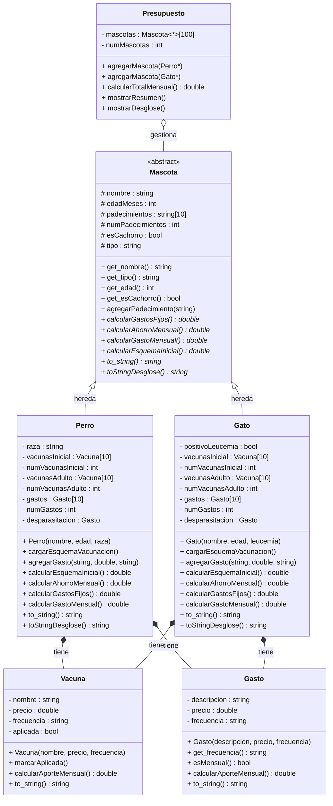

# PetBudget

PetBudget es un sistema orientado a objetos en C++ para ayudar a los dueños de perros y gatos a planear sus gastos veterinarios mensuales. El programa calcula cuánto dinero necesitan apartar cada mes para cubrir los gastos fijos y ahorrar para los gastos anuales de sus mascotas.

---

## Objetivo del proyecto

Desarrollar un planificador financiero para tenencia responsable de mascotas, que tome en cuenta el protocolo oficial de vacunación y desparasitación, y permita al usuario registrar gastos adicionales personalizados por mascota.

---

## Descripción general del sistema

El programa maneja el flujo completo del cálculo de gastos:

- Registro de perros y gatos con sus datos personales y padecimientos.
- Carga automática del protocolo de vacunación y desparasitación según la especie, edad (cachorro/adulto) y, en el caso de los gatos, resultado del test de leucemia felina.
- Registro manual de medicamentos y gastos adicionales específicos de cada mascota.
- Cálculo del presupuesto mensual separando gastos fijos y ahorro mensual.
- Desglose completo por vacuna y gasto con su aporte mensual.

---

## Estructura de clases

| Clase | Tipo | Descripción |
|-------|------|-------------|
| `Mascota` | Abstracta | Clase base: nombre, edad, padecimientos |
| `Perro` | Concreta | Hereda de Mascota; aplica esquema de vacunación canino según edad |
| `Gato` | Concreta | Hereda de Mascota; considera resultado de test de leucemia felina |
| `Vacuna` | Concreta | Nombre, precio, frecuencia; precargadas por especie |
| `Gasto` | Concreta | Medicamentos y gastos adicionales registrados manualmente |
| `Presupuesto` | Concreta | Gestiona todas las mascotas y calcula el total mensual |

---

## Diagrama UML



---

## Conceptos de POO implementados

### Herencia
`Perro` y `Gato` heredan de `Mascota` usando `public Mascota`, obteniendo sus atributos `protected` e implementando sus métodos abstractos.

### Modificadores de acceso
- `protected` en `Mascota` para que las subclases accedan a `nombre`, `edadMeses` y `esCachorro`.
- `private` en todas las demás clases para encapsular sus atributos.
- `public` para constructores y métodos de interfaz.

### Sobrecarga de métodos
- `agregarMascota(Perro*)` y `agregarMascota(Gato*)` en `Presupuesto`.
- `menuGastosExtra()` en `main.cpp`, con versión para `Perro` y para `Gato`.

### Sobreescritura de métodos
- `calcularGastoMensual()`, `to_string()`, `toStringDesglose()`, `calcularGastosFijos()`, `calcularAhorroMensual()` y `calcularEsquemaInicial()` se declaran abstractos en `Mascota` y cada subclase los implementa con su propia lógica.

### Polimorfismo
`Presupuesto` maneja un arreglo `Mascota* mascotas[100]` que puede contener perros y gatos mezclados. Al llamar `mascotas[i]->calcularGastoMensual()` o `mascotas[i]->to_string()`, C++ decide en tiempo de ejecución qué versión usar.

### Clases abstractas
`Mascota` declara sus métodos con `= 0`, lo que la convierte en abstracta y obliga a `Perro` y `Gato` a implementarlos todos.

---

## Casos que harían fallar el proyecto

- Agregar más de 10 vacunas o gastos a una mascota (límite del arreglo estático).
- Ingresar una edad negativa (el programa calcularía `esCachorro` incorrectamente).
- Registrar más de 100 mascotas (límite del arreglo en `Presupuesto`).
- Ingresar una frecuencia diferente a `mensual`, `trimestral` o `anual`.

---

## Protocolo de vacunación precargado

Los esquemas están basados en recomendaciones de la WSAVA y precios de referencia de clínicas veterinarias en México (2025).

### 🐶 Perros

**Esquema inicial cachorro (gasto único):**

| Vacuna | Precio (MXN) |
|--------|-------------|
| Puppy DP (Moquillo + Parvovirus) | $300 |
| Polivalente (Séxtuple) | $500 |
| Refuerzo Polivalente | $500 |
| Rabia | $200 |
| **Total esquema inicial** | **$1,500** |

**Esquema adulto (ahorro mensual):**

| Vacuna | Precio (MXN) | Aporte mensual |
|--------|-------------|----------------|
| Polivalente (Séxtuple) | $500 anual | $41.67/mes |
| Rabia | $200 anual | $16.67/mes |
| Desparasitación | $100 c/3 meses | $33.33/mes |
| **Total ahorro** | | **$91.67/mes** |

### 🐱 Gatos

**Esquema inicial cachorro (gasto único):**

| Vacuna | Precio (MXN) |
|--------|-------------|
| Trivalente Felina | $350 |
| Refuerzo Trivalente | $350 |
| Refuerzo Trivalente 2 | $350 |
| Rabia | $200 |
| Leucemia Felina* | $400 |
| Refuerzo Leucemia Felina* | $400 |
| **Total esquema inicial** | **$2,050** |

**Esquema adulto (ahorro mensual):**

| Vacuna | Precio (MXN) | Aporte mensual |
|--------|-------------|----------------|
| Trivalente Felina | $350 anual | $29.17/mes |
| Rabia | $200 anual | $16.67/mes |
| Leucemia Felina* | $400 anual | $33.33/mes |
| Desparasitación | $100 c/3 meses | $33.33/mes |
| **Total ahorro** | | **$112.50/mes** |

> *Solo se aplica si el test de leucemia felina resulta negativo.

---

## Lógica del presupuesto mensual

- **Esquema inicial (solo cachorros):** Gasto único que debe cubrirse de inmediato. No se incluye en el presupuesto mensual.
- **Ahorro mensual:** Vacunas y desparasitación del esquema de adulto divididas según frecuencia. Se calcula desde que la mascota es cachorro para tener el dinero listo cuando cumpla 12 meses.
- **Gastos fijos mensuales:** Medicamentos y tratamientos que se pagan cada mes.

**Total mensual = Ahorro mensual + Gastos fijos mensuales**

---

## Notas del programa

**Para cachorros:**
> El esquema inicial de vacunación es un gasto único que debes cubrir de inmediato y no está incluido en el presupuesto mensual. El ahorro mensual está calculado para que cuando tu mascota cumpla 12 meses tengas cubierto su primer esquema de adulto.

**Para adultos:**
> Este presupuesto asume que tu mascota acaba de recibir sus vacunas y desparasitación. Tienes aproximadamente 12 meses para ahorrar para las próximas vacunas y 3 meses para la siguiente desparasitación.

---

## Estructura de archivos

- `mascota.h` — Clase base abstracta con 6 métodos virtuales puros.
- `vacuna.h` — Clase Vacuna con precio y frecuencia.
- `gasto.h` — Clase Gasto con soporte para frecuencia trimestral.
- `perro.h` — Hereda de Mascota; esquema canino con desglose.
- `gato.h` — Hereda de Mascota; esquema felino con leucemia y desglose.
- `presupuesto.h` — Gestiona mascotas con polimorfismo; resumen y desglose.
- `main.cpp` — Menú interactivo en consola.

---

## Instalación y ejecución

Para compilar el proyecto:
```
g++ *.cpp -std=c++17 -o PetBudget
```

Para ejecutar:

```
./PetBudget
```

---

## Referencias

- BBVA México. (2024). *Guía práctica para saber cuánto cuesta tener un perro*. https://www.bbva.mx/educacion-financiera/banca-digital/cuenta-digital-cuanto-cuesta-tener-perro.html
- Cronista México. (2025). *Llega SimiPet Care: estos son los costos de los servicios para perros y gatos*. https://www.cronista.com/mexico/actualidad-mx/llega-simipet-care-estos-son-los-costos-de-las-consultas-vacunas-y-otros-servicios-para-perros-y-gatos/
- Hills Pet México. (s.f.). *Todo sobre las vacunas para gatos*. https://www.hillspet.com.mx/cat-care/routine-care/vaccinating-your-kitten
- Tala México. (2023). *¿Cuánto cuesta tener un michi?* https://talamobile.mx/2023/03/21/blog-cuanto-cuesta-tener-un-michi/
- WSAVA Vaccination Guidelines Group. (2022). *WSAVA Guidelines for the Vaccination of Dogs and Cats*. https://wsava.org/global-guidelines/vaccination-guidelines/
